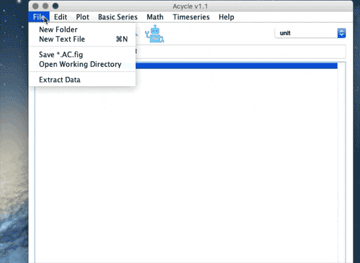
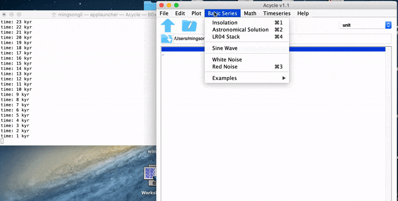
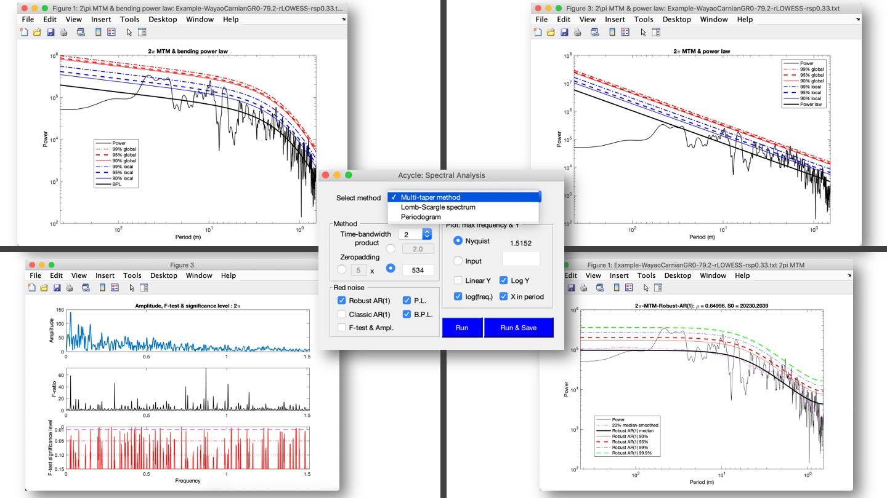
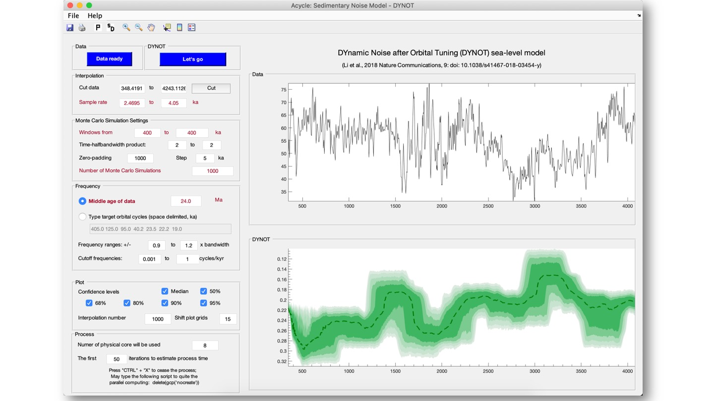
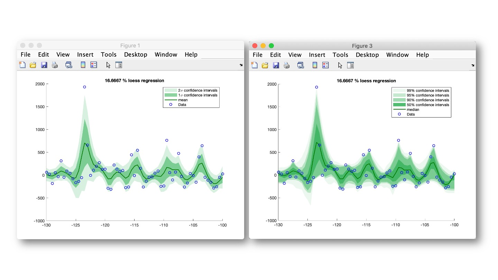
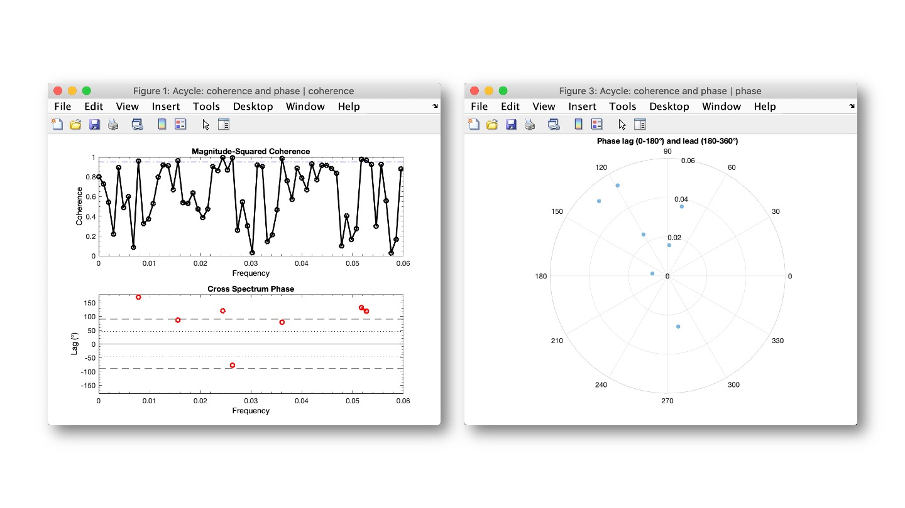
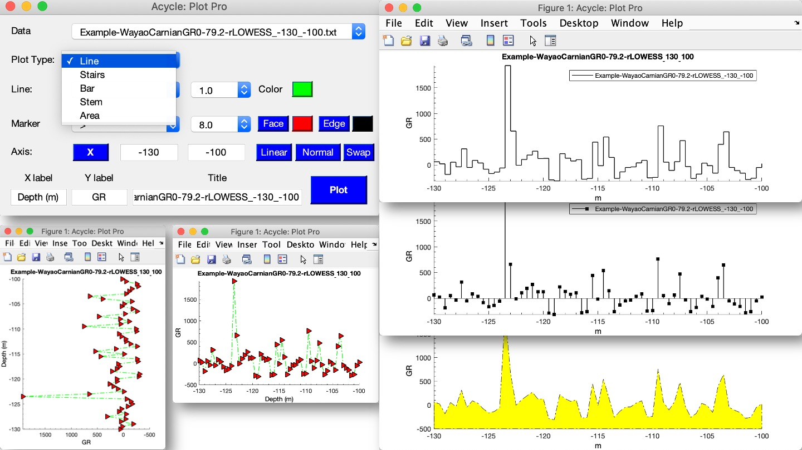
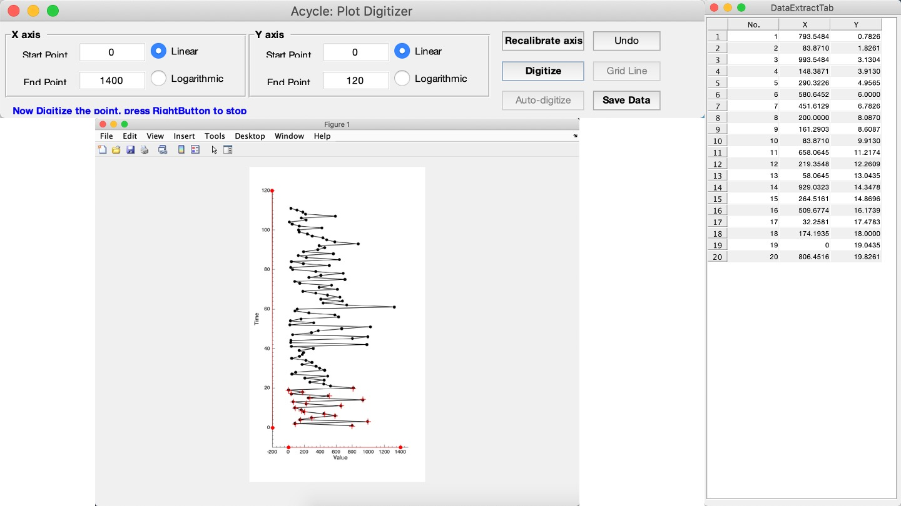

---
layout: page
title: Examples
--- 

<section id = "project">
    <section id = "gui">
        

        

            

                

                        <h3>Acycle menu</h3>
                

                
                <h5> Acycle menu</h5>
            

        

    </section>
    <section id = "insolation">
        

        

            

                

                        <h3>Acycle insolation toolbox</h3>
                

                
                <h5> Acycle insolation toolbox</h5>
            

        

    </section>
    <section id = "inso">
        

        

            

                

                        <h3>Acycle insolation toolbox</h3>
                

                
                <h5> Mean insolation map from March 21 to Sept. 23 for the past 100 kyr (1-100) at 50-80°N using the Laskar et al. (2004) solutions. The calculate uses a solar constant of 1365 w/m^2</h5>
            

        

    </section>
    <section id = "evofft">
        

        

            

                

                        <h3>Evolutionary FFT</h3>
                

                
                <h5> Evolutionary FFT of the astronomical solution</h5>
            

        

    </section>
    <section id = "spectral">
        

        

            

                

                        <h3>Power spectral analysis</h3>
                

                
                <h5> 2π multi-taper method power spectrum of the gamma ray series is shown with `20%` median-smoothed spectrum, background AR(1) model, and 90%, 95%, 99%,  and 99.9% confidence levels.</h5>
            

        

    </section>
    <section id = "Tools">
        

        

            

                

                        <h3>Most Used Tools</h3>
                

                
                <h5> Examples #1 Curve fitting | detrending | smoothing</h5>
                

                
                <h5> Examples #2 Power spectral analysis</h5>
                

                
                <h5> Examples #3 Evolutionary power spectral analysis and Wavelet analysis</h5>
                

                
                <h5> Examples #4 COCO of sedimentation rate evaluation</h5>
                

                
                <h5> Examples #5 eCOCO of sedimentation rate evaluation</h5>
                

                
                <h5> Examples #6 Filtering</h5>
                

                
                <h5> Examples #7 Tuning</h5>
                

                
                <h5> Examples #8 DYNOT sedimentary noise model</h5>
                

                
                <h5> Examples #9 Smoothed bootstrap</h5>
                

                
                <h5> Examples #10 Coherence and phase</h5>
                

                
                <h5> Examples #11 Plot Pro</h5>
                

                
                <h5> Examples #12 Image profile</h5>
                

                
                <h5> Examples #13 Plot Digitizer</h5>
                

            

        

    </section>
</section>
