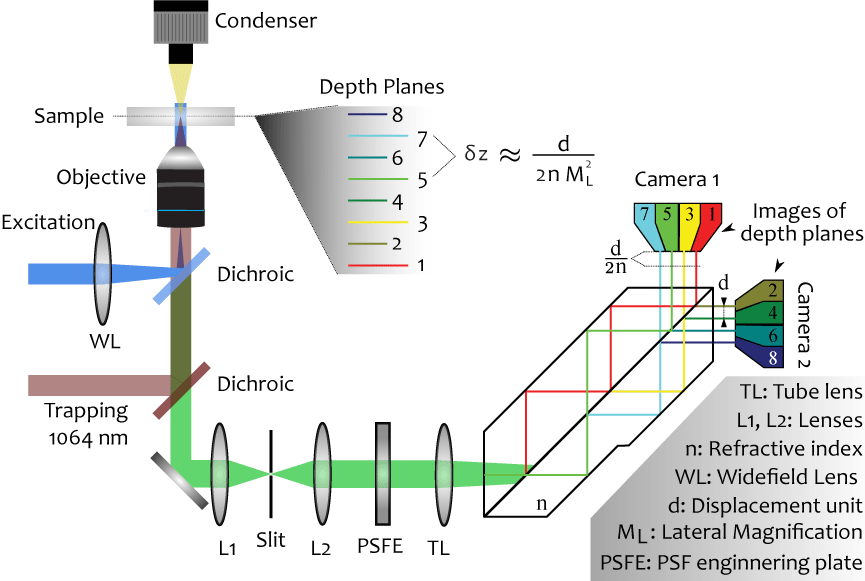

---
layout: page
title: Projects
--- 
<section id = "project">
	<section id = "Setup">
		

		

			

				

						<h3>Multiplane imaging</h3>
				

				
				<h5> 3D imaging & 3D particle tracking to answer material science questions</h5>
				
A large part of my work is dedicated to the improvement and maintenance of a multiplane wide-field setup at Hofkens Group in KULeuven. I am mostly using to investigate materials using super-resolution localization imaging and particle tracking in three dimensions. 

			

		

	</section>
	<section id = "Reptation">
		

		

			

				

						<h3>Reptation of polymer chain, a three-dimensional view </h3>
				

				
				<h5 > Introduction </h5>
				
Bridging the gap between the micro- and macroscale requires appropriate models. Our current theoretical understanding of entangled polymer chain dynamics is based on the reptation model. First proposed by de Gennes (Nobel Prize of Physics, 1991) and further expanded by Doi and Edwards, the reptation model assumes that a polymer chain is confined by the surrounding matrix and is therefore forced to move inside an imaginary tube defined by the transient network of entangled neighboring chains.

				
While reptation theory has proven to be a powerful tool, there are significant discrepancies between its predictions and the experimental results. These differences mainly arise because the model neglects the presence of cooperative network interactions – differences in segment diffusion due to tube diameter variations and different local friction between monomer units and the matrix are ignored. While there is substantial interest in developing improved models, one of the limitations has been the difficulty in acquiring experimental data that can truly resolve the heterogeneity of polymer dynamics, preferably by avoiding ensemble averaging entirely and observing just a single chain.

				<h5 > Reptation in 3D </h5>
				
We will image single polymer molecule chain on the multiplane setup. Hopefully revealing their motion and reptation behavior in three dimension. The motion will be compared to the ones predicted by the model. Influence of the size of the tube will also be investigated.

			

		

	</section>
	<section id = "PICNetwork">
		

		

			

				

						<h3>Characterization of hydrogel networks in 3D</h3>
				

				
				<h5> Introduction </h5>
				
Polyisocyanopeptide (PIC) hydrogels are a new generation of synthetic material that possess viscoelastic properties close to biopolymer networks, such as collagen. One of their main advantages over their non-synthetic counterpart is that their mechanical properties can be easily tuned. Despite being well characterized at the macroscale using bulk rheology, their properties at the microscale remain, to a large extent, unknown.

				<h5 > Structural characterization</h5>
				
 By labelling and subsequent imaging of polymer network, images such as the one displayed can be obtained. Then, segmentation and further processing allow to extract structural parameter such as porosity, connectivity,...
				 

				<h5 > Mechanical characterization</h5>
				
By embedding reporters (e.g. fluorescent beads) in the hydrogel and observing their motion through time, one can characterization the rheology of the polymer at a microscale. After acquisition of sufficient amount of data, a full picture of the distribution making the bulk rheology can be reconstructed. 

			

		

	</section>
	<section id = "Gold">
		

		

			

				

						<h3>Gold assembly particles, a three-dimensional view</h3>
				

				
				<h5> Introduction </h5>
				
Basically, laser trapping of a target object only takes place in the focal spot when they are irradiated by the tightly focused laser beam. Previously, the group of Prof. Masuhara reported that a large assembly with dynamically swarming gold nanoparticles is formed by laser trapping at upper glass/solution interface. The particles extend outside the focal spot perpendicularly to linear polarized laser light, giving a dumbbell-shaped assembly (Kudo et al. 2018). 

				<h5 > Three-dimensional characterization</h5>
				
 To understand deeper the phenomenon, in collaboration with Prof. Masuhara, we will recreate their assembly on a multiplane setup. Additionally, we will use data processing tools developped in our lab to bring more quantitative insight to the observation.
				 

			

		

	</section>
</section>