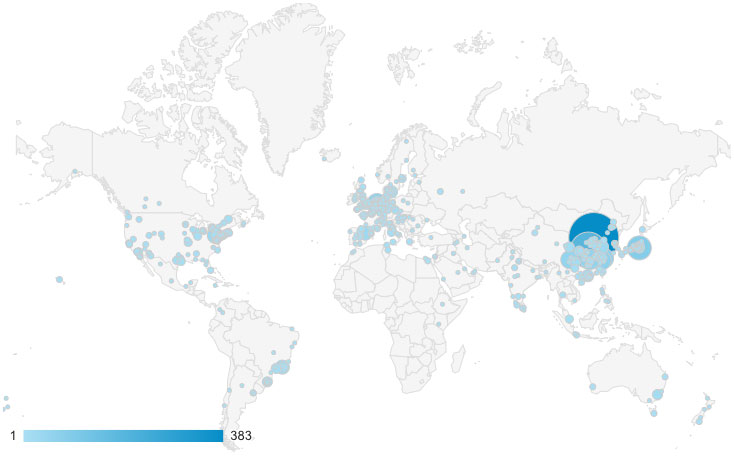

<body data-spy="scroll" data-target="#myNavBar" data-offset="100">
		<!--PROFILE PICTURE-->
		<section id="about" class="container-fluid">
			

				
				

					<h1> ACYCLE </h1>
					<h3>time-series analysis software  
					    for paleoclimate research and education    open source
					      graphical user interface (GUI) </h3>
					<a href="docs/Li-et-al-2019-Acycle-software.pdf" class="button1"> Download Acycle Paper </a>
				

			

		</section>	
                                <!--MOST USED TOOLS-->
                                <section id="skills">
                                    

                                    

                                    
                                     
                                        <h2>MOST USED TOOLS</h2>
                                    

                                    

                                        

                                            

                                                

                                                    

                                                        <h5>Spectral Analysis 65%</h5>
                                                    

                                                

                                                

                                                    

                                                        <h5>Evolutionary Spectral Analysis 43%</h5>
                                                    

                                                

                                                

                                                    

                                                        <h5>Smoothing | Detrending 39%</h5>
                                                    

                                                

                                            

                                                    

                                                        <h5>Astronomical solutions 39%</h5>
                                                    

                                                

                                            

                                            

                                                

                                                    

                                                        <h5>Correlation Coefficient 35%</h5>
                                                    

                                                

                                                

                                                    

                                                        <h5>Wavelet 26%</h5>
                                                    

                                                

                                                

                                                    

                                                        <h5>Insolation 22%</h5>
                                                    

                                                

                                                

                                                    

                                                        <h5>Sedimentary Noise Model 13%</h5>
                                                    

                                                

                                            

                                        

                                    

                                </section>
                                <section id = "figures">
                                    

                                    

                                    
                                     
                                        <h2>Global Visitors</h2>
                                    

                                    

                                    

                                    
Total: 3,621 unique visitors <a href="https://analytics.google.com" target="_blank" rel="noopener noreferrer"> (data source)</a>.

                                    
 Sept 2018 – Feb 2020

                                </section>
                                <section id = "figures">
                                    

                                    

                                    
                                     
                                        <h2>Cited By</h2>
                                    

                                    

                                    <iframe src="https://academic.microsoft.com/paper/2919969996/citedby/search?q=Acycle%3A%20Time-series%20analysis%20software%20for%20paleoclimate%20research%20and%20education&qe=RId%3D2919969996&f=&orderBy=3" width="100%" height="700">
                                      
Your browser does not support iframes.

                                    </iframe>
                                    
Data source: <a href="https://academic.microsoft.com/paper/2919969996/citedby/search?q=Acycle%3A%20Time-series%20analysis%20software%20for%20paleoclimate%20research%20and%20education&qe=RId%3D2919969996&f=&orderBy=3" target="_blank" rel="noopener noreferrer">Microsoft Academic</a>. Or more citations: <a href="https://scholar.google.com/scholar?oi=bibs&hl=en&cites=17133348578794397884" target="_blank" rel="noopener noreferrer">Google Scholar</a>.

                                

                                </section>
                        <!--What they say-->
                        <section id = "theysay">
                            

                            

                            
                             
                                <h2>What they say</h2>
                            

                            

                                <ol class="carousel-indicators">
                                    <li data-target="#myCarousel" data-slide-to="0" class="active"></li>
                                    <li data-target="#myCarousel" data-slide-to="1"></li>
                                    <li data-target="#myCarousel" data-slide-to="2"></li>
                                    <li data-target="#myCarousel" data-slide-to="3"></li>
                                    <li data-target="#myCarousel" data-slide-to="4"></li>
                                    <li data-target="#myCarousel" data-slide-to="5"></li>
                                </ol>
                                

                                    

                                        <h3>Dr. J. Fred Read (Virginia Tech, USA)</h3>
                                        <h4>
"I am writing to express my appreciation for all the hard work and thought that has gone into the development of the Acycle software program. It is truly an amazing contribution to the geosciences community. As someone who has spent much of the last 50 years trying to understand cyclic carbonates on shallow platforms, and having been involved with my students in some of the early work on stratigraphic modelling of the effects of Milankovitch forcing of carbonate platform stratigraphy, I was blown away by the power of the Acycle software. 

                                        
In the old days we used in house programs from our geophysicist Cahit Coruh, and recently I have used Analyseries, kSpectra and Timefrq43, moving from Dos to Windows to Mac, jumping from one to the other to get the job done. Acycle has done away with the need for this, and I have been impressed with how very user friendly the program is – an indication of the tremendous effort and thought that has gone into putting this together. 

                                        
You should all feel very proud of this contribution. It opens up much needed access to these powerful tools for a wide audience in the sedimentary geology and paleoclimate community. Thanks again for all your efforts. A really marvellous job."
</h4>
                                    

                                    

                                        <h3>Dr. James Ogg (Purdue University, USA)</h3>
                                        <h4>
"Acycle software enables us to quickly analyze the potential of new outcrops and boreholes, and then to determine the sedimentation rates and elapsed time. His Acycle software will become the standard tool for time-scale applications by all international workers."

                                         
                                         
                                         
                                         
                                         
                                         
                                         
                                         
                                         
                                         
                                         
                                         
                                         
                                         
                                         
                                         
                                        </h4>
                                    

                                    

                                        <h3>Dr. Paul E. Olsen (Columbia University, USA)</h3>
                                        <h4>
"Not only is this software powerful and effective, it is also simple to use and therefore benefits researchers and at all levels within the paleoclimatology community, from novices to experts."
</h4>
                                         
                                         
                                         
                                         
                                         
                                         
                                         
                                         
                                         
                                         
                                         
                                         
                                         
                                         
                                         
                                         
                                         
                                    

                                                

                                                    <h3>Dr. Frits Hilgen (Utrecht University, Netherlands)</h3>
                                                    <h4>
"I used it this academic year for the first time in my MSc course on Astronomical climate forcing and time scales as replacement of the outdated Analyseries program. 

                                                    
The main advantages of Acycle is that it is very user friendly, has a lot of different options for the statistical analysis of paleoclimate records and in addition first-rate plotting options. For instance you can directly see the trend that you aim to remove and then decide whether you want to continue with it. It is further also very good to see the fast and almost continuous improvement of Acycle, including the processing of reported bugs. And, not unimportantly, also my students were very enthusiastic about Acycle and I now use it now for my own research as well!"

                                                     
                                                     
                                                     
                                                     
                                                     
                                                     
                                                     
                                                     
                                                    </h4>
                                                

                                                

                                                    <h3>Dr. Nicolas R. Thibault (University of Copenhagen, Denmark)</h3>
                                                    <h4>
"I’ve been playing a lot with the excellent Acycle package for Matlab that Mingsong developed. Congratulations, this is a very nice interface that simplifies a lot our work and makes it truly faster to analyse a time-series."

                                                     
                                                     
                                                     
                                                     
                                                     
                                                     
                                                     
                                                     
                                                     
                                                     
                                                     
                                                     
                                                     
                                                     
                                                    </h4>
                                                

                                                

                                                    <h3>Dr. Xu Yao (Lanzhou University, China)</h3>
                                                    <h4>
"I am working on cyclostratigraphy and paleoclimate study of ancient strata and rocks (270 million years ago) with assistance from Acycle software. I also introduced this software to my colleagues whose research areas are paleoclimate implications of Quaternary loess (several thousand years ago). My colleagues have given me really good feedbacks about Acycle software."

                                                     
                                                     
                                                     
                                                     
                                                     
                                                     
                                                     
                                                     
                                                     
                                                     
                                                     
                                                     
                                                     
                                                     </h4>
                                                

                                

                                
                                
                            

                        </section>
		<footer class="text-center">
			<a href="#about">
				
			</a>
			<!--<h5>
				© Copyright Mingsong Li
			</h5>-->
		</footer>
</body>
